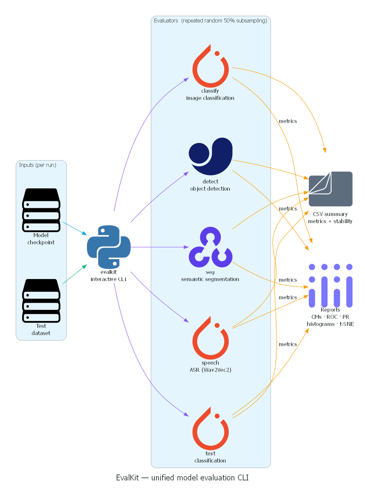

# EvalKit

A unified **evaluation toolkit** for benchmarking five core AI model types—image classification, object detection, semantic segmentation, speech recognition, and text analysis—under repeated random‑subsampling.
The tool answers two key questions for **every** checkpoint:

* **Performance** – classic metrics such as accuracy, mAP, mean IoU, WER.
* **Stability** – variance of those metrics across multiple 50 % data slices.



*Rendered from [`docs/howitworks.py`](docs/howitworks.py) (Python `diagrams` library).*

---

## Features

| Capability                      | Detail                                                                 |
| ------------------------------- | ---------------------------------------------------------------------- |
| **Five evaluators**             | `classify`, `detect`, `seg`, `speech`, `text`                          |
| **Interactive CLI**             | Guided prompts for model paths, datasets, loop count, device selection |
| **Automatic device fallback**   | GPU (CUDA 0) if available, else CPU                                    |
| **Version‑pinned requirements** | `requirements.txt` generated via helper script                         |
| **Rich reports**                | Confusion matrices, PR curves, IoU/HD histograms, t‑SNE plots          |
| **CSV summaries**               | Aggregated metrics plus stability row for easy comparison              |
| **Minimal dependencies**        | Pure‑Python; only PyTorch, Ultralytics, Transformers, etc.             |

---

## Repository layout

```
evalkit/                 ← CLI entry‑point and helpers
  └── __main__.py
  └── results/           ← auto‑generated artefacts

evaluators/              ← one file per task
  ├── image_classification.py
  ├── object_detection.py
  ├── segmentation.py
  ├── speech_recognition.py
  └── text_analysis.py

collect_requirements.py  ← optional helper to regenerate requirements.txt
requirements.txt         ← pinned third‑party libraries
README.md                ← this file
```

---

## Installation

> **Prerequisites:** Python ≥ 3.10  |  Linux, macOS, or Windows  |  (Optional) NVIDIA GPU with CUDA 11.8

```bash
# 1️⃣ Create and activate a virtual environment (optional but recommended)
python -m venv venv
source venv/bin/activate        # Windows: venv\Scripts\activate

# 2️⃣ Install dependencies and the package itself
pip install -r requirements.txt
pip install -e .                # editable install for local development
```

---

## Quick start

```bash
$ ai-eval                     # launch CLI
> 1                           # select "classify"
? Model checkpoint: resnet50_cifar10.pth
? Test‑data folder: data/cifar10_test
? Number of loops [10]: 10
✔ Evaluation started …
```

*The same flow applies to the other tasks (`detect`, `seg`, `speech`, `text`).*

---

## Evaluator overview

| Task       | Dataset expectation                               | Core framework        | Key metrics                      |
| ---------- | ------------------------------------------------- | --------------------- | -------------------------------- |
| `classify` | CIFAR‑10‑style folder (10 sub‑dirs)               | PyTorch + TorchVision | Top‑1 / Top‑5 Acc, Confusion Mtx |
| `detect`   | YOLOv8/10 weights + YOLO YAML                     | Ultralytics           | mAP\@0.5, IoU histogram          |
| `seg`      | Satellite `*_sat.jpg` & `*_mask.png`              | SMP + Albumentations  | mean IoU, Dice, HD95             |
| `speech`   | LibriSpeech‑like tree of `*.flac` + `*.trans.txt` | Wav2Vec 2.0           | WER, CER                         |
| `text`     | CSV (`text`,`label`)                              | HF Transformers       | Accuracy, PR‑AUC, t‑SNE          |

---

## Results directory

Each loop writes artefacts to `results/<task>/result_<n>/`:

| File           | Purpose                                          |
| -------------- | ------------------------------------------------ |
| `results.txt`  | High‑level metric summary                        |
| `*_report.txt` | Detailed class/label metrics                     |
| Plots (`.png`) | Confusion matrix, PR curve, histograms, overlays |
| JSON / CSV     | Raw predictions or per‑image metrics             |

After **N** loops an `*_evaluation_results.csv` file is written alongside the loop folders containing all metrics **plus** a final “stability” row showing the percentage of runs within ±2 pp of the mean.

---
